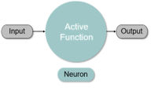
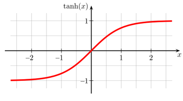
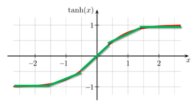
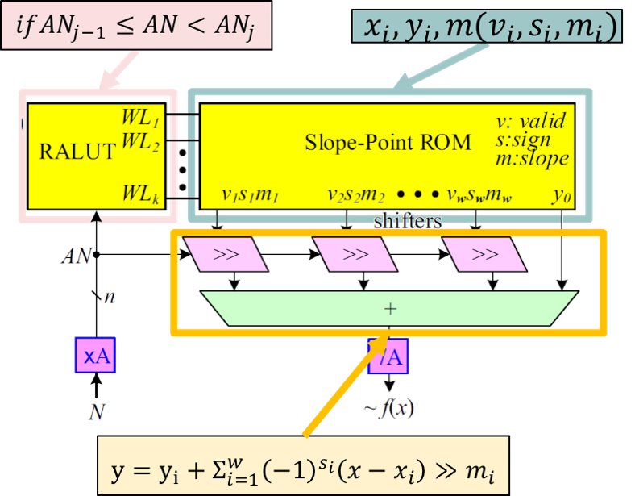

# 目錄
* 1. [AN Codes LS-PWL-RALUT 題目說明](https://github.com/Wilhelmine21/Wilhelmine21/tree/main/MyProject_GUI#this-project-is-about-my-research)
* 2. [AN codes](https://github.com/Wilhelmine21/Wilhelmine21/blob/main/MyProject_GUI/Readme.md#an-codes-----wiki)
* 3. [Light Number](https://github.com/Wilhelmine21/Wilhelmine21/blob/main/MyProject_GUI/Readme.md#light-number)
		
# AN Codes LS-PWL-RALUT 題目說明
  
	
* 為什麼要使用查表及AN codes?	
	*  關於神經網絡中的`激勵函數`和`量化`，我們可能會遇到需要應用於`任何函數`的情況，並且它可能具有各種函數，那這些函數可能是複雜的，也可能是無法被符號積分微分的函數。 在這種情況下，最合適的方法是使用`查表`。
	*  對於傳統的查表，它有幾個缺點。首先是它需要記憶體去記錄，並使用了ROM。第二個是它記錄的數量非常大。因此，有些人使用PWL和RALUT來解決這些問題，但是對於第一個PWL來說，它需要乘法器，而這會佔用面積；然後對於第二個RALUT來說，它記錄的數量仍然很多。
	*  因此，我們可以使用`輕數斜率(Light Slope)`來改善這兩個缺點，那我們提出的方法是`輕數斜率分段線性範圍可循址查表(LS-PWL-RALUT)`。
	*  隨著科技的發展，越來越多電動汽車使用神經網絡進行訓練，讓汽車得以自動駕駛。但是，我們時不時聽到有關於自動駕駛汽車的車禍事故。因此，提高神經網絡的`可靠度`是非常重要的。
	*  對於神經網絡的前幾層它具有自我修復的作用，但是對於最後一層它具有決定性的作用。最後一層的激勵函數通常不是像ReLU這樣簡單的函數，而是複雜的函數，那更應該使用查表去處理。但是由於來自通道或運算的雜訊，這一層很容易受到影響而錯誤。因此，為了能夠更正錯誤，我們添加了`AN codes`以提高神經網絡的可靠度。

* 如何使用移位而不用乘法?	
	*  下圖是一個tanh(x)的圖，它是一個常見的激勵函數
		  
	*  那我們的方法會對它進行線性分段，而這個分段的線段就可以用`點斜式`來表示
		  
	*  由於乘法會需要花費面積和時間，所以我們將斜率K替換成Light Number，這樣就可以使用移位的方式來完成這個式子，而不需要使用乘法器。
		  

* AN codes LS-PWL-RALUT模型與結構圖
	  
	* 將輸入值N乘以A，進入比較範圍，然後只有一條Word Line會被enable
	* 在ROM中查到對應的值，出來進行移位和加總，然後得到查表的輸出
	* 將其除以A，然後對其進行解碼以進行更正，最後獲得正確的值。

