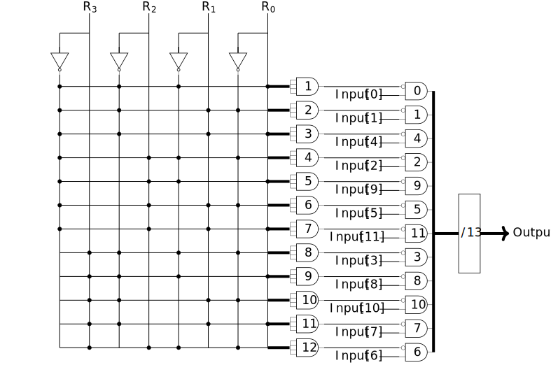
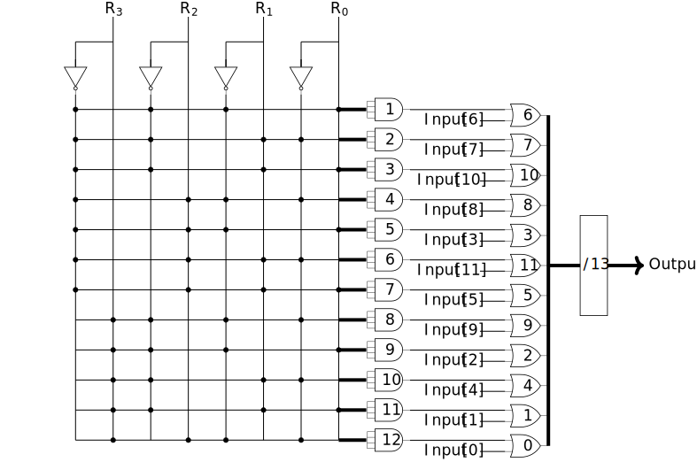
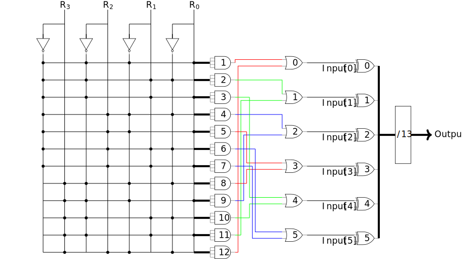

# 目錄 [[Back]](https://github.com/Wilhelmine21/Wilhelmine21/tree/main/MyProject_GUI#this-project-is-about-my-research)
* [AN Codes LS-PWL-RALUT 題目說明](https://github.com/Wilhelmine21/Wilhelmine21/blob/main/MyProject_GUI/AN%20Codes%20LS-PWL-RALUT.md#an-codes-ls-pwl-ralut-題目說明)
* [AN codes](https://github.com/Wilhelmine21/Wilhelmine21/blob/main/MyProject_GUI/AN%20Codes.md#an-codes-----wiki)
	* [1. 已知錯誤方向(Unidirectional)之完全非對稱模型](https://github.com/Wilhelmine21/Wilhelmine21/blob/main/MyProject_GUI/AN%20Codes.md#1-已知錯誤方向unidirectional之完全非對稱模型)
	* [2. 未知錯誤方向(Alternative direction)之完全非對稱模型](https://github.com/Wilhelmine21/Wilhelmine21/blob/main/MyProject_GUI/AN%20Codes.md#2-未知錯誤方向alternative-direction之完全非對稱模型)
	* [3. 位元錯誤率模型(Bit Error Rate model, BER)](https://github.com/Wilhelmine21/Wilhelmine21/blob/main/MyProject_GUI/AN%20Codes.md#3-位元錯誤率模型bit-error-rate-model-ber)
	* [4. 算術權重錯誤模型(Arithmetic Weight Error model, AWE)](https://github.com/Wilhelmine21/Wilhelmine21/blob/main/MyProject_GUI/AN%20Codes.md#4-算術權重錯誤模型arithmetic-weight-error-model-awe)
* [Light Number](https://github.com/Wilhelmine21/Wilhelmine21/blob/main/MyProject_GUI/Light%20Numbers.md#light-number)

# AN codes --- [wiki](https://en.wikipedia.org/wiki/AN_codes) 
  
* AN codes是一個以整數A和N來命名的在線糾錯碼。運作方法是將要處理的數字N乘以我們選擇適合的模數A，經過一些計算後，除以A並解碼得到N。如果Mod A等於零，那代表這個數字是正確的，如果不是，那我們會需要回去查表去進行更正。
* 我們使用Galois Field來創造一個數字環，這個環中的數字是通過乘以一定的倍數來計算的。
	* 例如，GF(7)可以使用x2或x3來創造數字環。但是我們不會使用x3的環，因為要處理的數字是二進制的，所以選擇2作為倍數。
		* 2 is a primitive element
			* GF(3)={0;1,2}
			* GF(5)={0;1,2,4,3}
			* GF(7)={0;1,2,4,3,6,5}
		* 3 is a primitive element
			* GF(7)={0;1,3,2,6,4,5} 
		
	* Example1(左下圖):
		* GF(13)從1開始，每個數依序乘以2後mod 13，然後我們可以得到13這個模數的數字環。
		* 當餘數為1時，就是2的0次方等於1，表示bit1是錯誤的；若餘數為2，也就是2的1次方，這代表bit2是錯誤的，依此類推，並且GF(13)的數字環必須包含1到12。如果不是，當餘數等於某一個不存在整數環中的數時，會無法確定要去糾正哪一個bit。
		
	* Example2(右下圖): 
		* GF(47)，這個數剛好可以形成兩個數字環，由+1和-1組成。這樣的好處是我們可以知道錯誤是來自加法還是減法，以此得到更廣的更正範圍。
					
	  
* 為什麼我們使用AN codes而不是Hamming codes呢?
	* 因為漢明碼經過計算後，它的檢查bit會被破壞，進而無法繼續具有更正錯誤的能力，而AN codes它可以經過計算後，依然具有更正錯誤的能力。

## **4 Error Model**
* 為了能夠有更好的更正效果，我們針對以下四種情況分別進行定義錯誤模型。
### 1. **已知錯誤方向(Unidirectional)之完全非對稱模型**
* 針對情況是事先已知錯誤會從1變0(Uni HL)或是從0變1(Uni LH)，此時模數A所對應的餘數環為單環，如下表。
			
	|Bit |11 |10 |9 |8 |7|6 |5 |4 |3 |2 |1 |0 |
	|:----:|:----:|:----:|:----:|:----:|:----:|:----:|:----:|:----:|:----:|:----:|:----:|:----:|
	|R+ |7 |10 |5 |9 |11 |12 |6 |3 |8 |4 |2 |1 |
	|R- |6 |3 |8 |4 |2 |1 |7 |10 |5 |9 |11 |12 |
			
* 假設模數A為n 位元，可更正(n-1)位元的數字。以模數A=13為例，它可更正的位元數為12(包含模數A本身)，可更正的範圍是0到255的數(不含模數A)。
* 由於已知錯誤方向，所以對應的餘數只有R+或R-，其解碼器電路如下圖。
* 左圖=>錯誤會從1變0(Uni HL), 右圖=>錯誤會從0變1(Uni LH)
								
  

### 2. **未知錯誤方向(Alternative direction)之完全非對稱模型**
* 針對情況是無法事先知道錯誤會從1變0或是從0變1，此時模數A所對應的餘數環為單環，如下表。
			
	|Bit |11 |10 |9 |8 |7|6 |5 |4 |3 |2 |1 |0 |
	|:----:|:----:|:----:|:----:|:----:|:----:|:----:|:----:|:----:|:----:|:----:|:----:|:----:|
	|R+ |7 |10 |5 |9 |11 |12 |6 |3 |8 |4 |2 |1 |
	|R- |6 |3 |8 |4 |2 |1 |7 |10 |5 |9 |11 |12 |
				
* 餘數環會呈現像是莫比烏斯環，依據錯誤方向來對應錯誤位置，上表中的R+對應到0變1的錯誤方向；R-對應到1變0的錯誤方向。
* 假設模數A為n 位元，可更正(n-1)位元的數字。以模數A=13為例，它可更正的位元數為12(包含模數A本身)，可更正的範圍是0到255的數(不含模數A)
* 但是因為是未知錯誤方向，所以對應的餘數較多，其解碼器電路，如下圖，為四種模型中面積最大的。
			
  
			
### 3. **位元錯誤率模型(Bit Error Rate model, BER)**
* 針對情況是電路受到干擾產生錯誤，由1變0或0變1，各有機率，此時模數A所對應的餘數環為雙環，如下表。
			
	|Bit  |5 |4 |3 |2 |1 |0 |
	|:----:|:----:|:----:|:----:|:----:|:----:|:----:|
	|s=0 |6 |3 |8 |4 |2 |1 |
	|s=1 |7 |10 |5 |9 |11 |12 |
		
* 假設模數A為n位元，可更正(n-1)/2位元的數字。以模數A=13為例，它可更正的位元數為6(包含模數A本身)，可更正的範圍是0到3的數(不含模數A)，其解碼器電路如下圖。
			
  
		
### 4. **算術權重錯誤模型(Arithmetic Weight Error model, AWE)**
* 針對情況是錯誤來自加法或減法，此時模數A所對應的餘數環為雙環，如下表。

	|Bit  |5 |4 |3 |2 |1 |0 |
	|:----:|:----:|:----:|:----:|:----:|:----:|:----:|
	|s=0 |6 |3 |8 |4 |2 |1 |
	|s=1 |7 |10 |5 |9 |11 |12 |

* 透過上表的餘數對應，我們可以得知當s=0，代表錯誤來自加法；當s=1，代表錯誤來自減法。
* 假設模數A為n位元，可更正(n-1)/2位元的數字。以模數A=13為例，它可更正的位元數為6(包含模數A本身)，可更正的範圍是0到3的數(不含模數A)
* 其解碼器電路如下圖，不同於BER模型，AWE有圖7中的add來檢查錯誤來自加法或減法。
			
  
