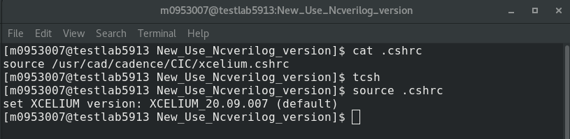
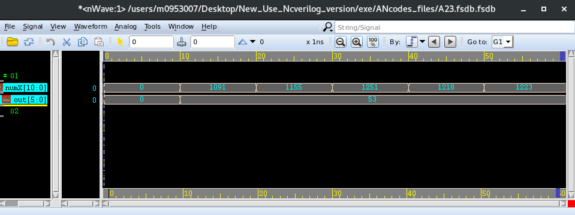

# 目錄 [[Back]](https://github.com/Wilhelmine21/Wilhelmine21/tree/main/MyProject_GUI)
* [My Research](https://github.com/Wilhelmine21/Wilhelmine21/blob/main/MyProject_GUI/My%20Research.md)
  * [AN codes](https://github.com/Wilhelmine21/Wilhelmine21/blob/main/MyProject_GUI/GUI-AN-codes.md)
  * [ANRCAM](https://github.com/Wilhelmine21/Wilhelmine21/blob/main/MyProject_GUI/GUI-ANRCAM.md)
  * [EDA](https://github.com/Wilhelmine21/Wilhelmine21/blob/main/MyProject_GUI/GUI-EDA.md)

# AN codes and Decoder

* 這個Project主要用來生成AN codes解碼器(Verilog file)

## Step 1. 找到可用的A
* (1) 輸入範圍 
	* 需大於10
* (2) 選擇錯誤模型
	* Uni HL: 單一錯誤方向之完全非對稱模型(錯誤由1變0)
	* Uni LH: 單一錯誤方向之完全非對稱模型(錯誤由0變1)
	* Alter: 未知錯誤方向之完全非對稱模型
	* BER: Bit Error Rate model
	* AWE: Arithmetic Weight Error model
* (3) A maybe欄位會展示出範圍內可用的A

## Step 2. 生成Verilog檔案
* (1) 在Select A輸入想要的A值
	* 此值須為A maybe欄位中出現過的數字
* (2) 按下`Gen & Show`，即可在select A下方的文字框看見生成的檔案內容  
  
* (3) 若是看不清楚，可使用上方選單File->Open File... 開啟檔案查看  
  

## Step 3. Verilog 驗證
* 這個功能使用[iVerilog](http://iverilog.icarus.com)和[GTKwave](http://gtkwave.sourceforge.net)來進行驗證
* 新版已增加在Linux環境下會使用`Ncverilog`和`nWave`來進行驗證
	* 目前版本在運行GUI前需手動輸入tcsh和source .cshrc
	  
		
* testbench會隨解碼器檔一起生成
	* 對同一個數字做不同bit錯誤 
	* 只要Output的數字一樣即為更正成功(上圖為GTKwave(Windows); 下圖為nWave(linux))
	  
---
## 上方的選單Help: 
 
* 前兩項會連結到iVerilog和GTKwave的官網
* 第三項 Error Model Descripton為錯誤模型的簡單說明及電路圖
	* 會根據Error Model選擇的不同而有改變說明 
	
	 
	
* 第四項Video則為AN codes這個project展示與說明的影片
* 最後About會顯示程式資訊 
	 
