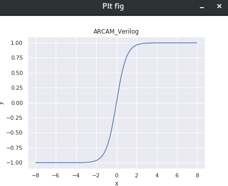

# 目錄 [[Back]](https://github.com/Wilhelmine21/Wilhelmine21/tree/main/MyProject_GUI#this-project-is-about-my-research)
* [My Research](https://github.com/Wilhelmine21/Wilhelmine21/blob/main/MyProject_GUI/My%20Research.md#my-research)
	* 1. [AN codes and Decoder](https://github.com/Wilhelmine21/Wilhelmine21/blob/main/MyProject_GUI/GUI-AN-codes.md#an-codes-and-decoder)
	* 2. [ANRCAM](https://github.com/Wilhelmine21/Wilhelmine21/blob/main/MyProject_GUI/GUI-ANRCAM.md#anrcam)
	* 3. [EDA](https://github.com/Wilhelmine21/Wilhelmine21/blob/main/MyProject_GUI/GUI-EDA.md#eda)
	
# ANRCAM
 

* 用途是透過設定基本參數，對激勵函數做線性分段，搜尋出最少的線段、範圍和輕數斜率等數據，然後生成verilog檔。
* 1. 基本參數設定
	<table>
	  <tbody>
	  <tr>
	    <th>參數名</th>
	    <th>說明</th>
	    <th>預設值</th>
	  </tr>
	  <tr>
	    <td> Input Bit </td>
	    <td> input總共bit數 </td>
	    <td> 12 </td>
	  </tr>
	  <tr>
	    <td> Left Range </td>
	    <td> inputX軸左範圍 </td>
	    <td> -8 </td>
	  </tr>
	  <tr>
	    <td> Right Range </td>
	    <td> inputX軸右範圍 </td>
	    <td> 8 </td>
	  </tr>
	  <tr>
	    <td> X Sign bit </td>
	    <td> input的符號位數 </td>
	    <td> 1 </td>
	  </tr>
	  <tr>
	    <td> X Int Bit </td>
	    <td> input的整數位數 </td>
	    <td> 3 </td>
	  </tr>
	  <tr>
	    <td> X Dec Bit</td>
	    <td> input的小數點後位數 </td>
	    <td> Input Bit-X Int Bitt-X Sign bit </td>
	  </tr>
	  <tr>
	    <td> b Sign Bit </td>
	    <td> 截距b的符號位數 </td>
	    <td> 1 </td>
	  </tr> 
	  <tr>
	    <td> b Int Bit </td>
	    <td> 截距b的整數位數 </td>
	    <td> 0 </td>
	  </tr>
	  <tr>
	    <td> b Dec Bit </td>
	    <td> 截距b的小數點後位數 </td>
	    <td> 16 </td>
	  </tr> 
	  <tr>
	    <td> Start </td>
	    <td> 輕數從0次方開始 </td>
	    <td> 0 </td>
	  </tr>
	  <tr>
	    <td> Shift </td>
	    <td> 輕數一組有幾bits </td>
	    <td> 3 </td>
	  </tr>
	  <tr>
	    <td> Light Numbers </td>
	    <td> 輕數是由幾組組成(weight) </td>
	    <td> 3 </td>
	  </tr>
	<tr>
	    <td> Targe Error </td>
	    <td> 允許最大的error值 </td>
	    <td> 0.001 </td>
	  </tr>
	</table>

* 2. Mode Setting
	<table>
	  <tbody>
	  <tr>
	    <th>參數名</th>
	    <th colspan = 2>說明</th>
	  </tr>
	  <tr>
	    <td rowspan= 4> Mode </td>
	    <td> 0 </td>
	    <td> light number的每一組都支援0 </td>
	  </tr>
	  <tr>
	    <td> 1 </td>
	    <td> light number的每一組都不支援0，因此如果需要為0，會用互補的方式處理 (light number為奇數時，會容易互補不了) </td>
	  </tr>
	  <tr>
	    <td> 2 </td>
	    <td> 保留 </td>
	  </tr>
	  <tr>
	    <td> 3 </td>
	    <td> light number僅最後一組支援0 </td>
	  </tr>
	  <tr>
	    <td rowspan= 3> Finish Mode </td>
	    <td> 0 </td>
	    <td> 快速，通常與完整掃描的一樣，但不保證結果最佳 </td>
	  </tr>
	  <tr>
	    <td> 1 </td>
	    <td> 完整掃描，數據大容易很慢，很慢時請先用mode0試 </td>
	  </tr>
	  <tr>
	    <td> 2 </td>
	    <td> 測試 </td>
	  </tr>
	  <tr>
	    <td rowspan= 2> Run Mode </td>
	    <td> 0 </td>
	    <td> 正常運行 </td>
	  </tr>
	  <tr>
	    <td> 1 </td>
	    <td> RALUT模式 </td>
	  </tr>
	  <tr>
	    <td rowspan= 2> Verilog Mode </td>
	    <td> 0 </td>
	    <td> verilog中使用IN+1 </td>
	  </tr>
	  <tr>
	    <td> 1 </td>
	    <td> verilog中使用IN </td>
	  </tr>
	  </table>
	  
## `Show fig`功能鍵
* 這裡會根據參數的設定來跑出4張比較圖
	* 1. 用軟體將斜率a轉成輕數所畫出來的激勵函數圖
	* 2. 斜率a轉成輕數與正確值的誤差圖
	* 3. 斜率a轉成輕數所確定的截距b圖
	* 4. 輕數斜率a的圖
		
## `Generate`功能鍵  
* 主要的功能鍵
* 搜尋最少線段和生成verilog檔
	* 1. 先確認X,b的參數設定
	* 2. 再來確定A有沒有選對(保護Bit夠不夠)
	* 3. 開始運算
	* 4. 產生線段數據, 範圍數據(pattern_xA), 輕數斜率與截距數據(ver_xA), ANRCAM.v, ANRCAM_tb.v等檔案
	* 5. 展示出2張圖: (1) 用搜尋後的輕數斜率與截距畫出激勵函數 (2) 所得值與正確值的誤差

## `VCD`功能鍵
* 使用[iVerilog](http://iverilog.icarus.com/)和[GTKwave](http://gtkwave.sourceforge.net/)來進行驗證
* 新版已增加在Linux環境下會使用`Ncverilog`和`nWave`來進行驗證
	* 目前版本在運行GUI前需手動輸入tcsh和source .cshrc
	* Run Default值所出現的波形圖
	  
* 開始編譯ANRCAM.v與ANRCAM_tb.v，然後會產生ANRCAM.txt，裡面有輸入與輸出的數據

## `Plt fig`功能鍵
* 需先做`VCD` 
* 將verilog運算後的值(在ANRCAM.txt裡)畫成圖片 
	* Run Default值所出現的激勵函數圖
	  
