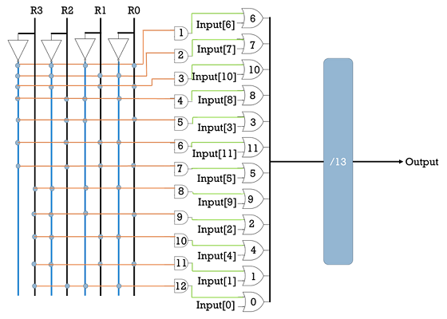
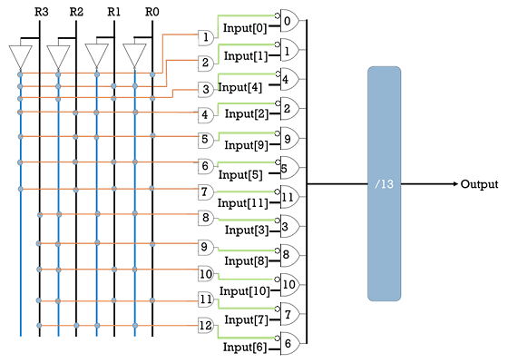
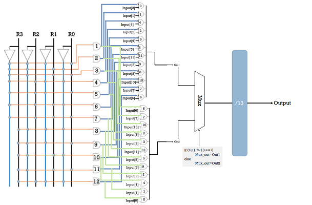
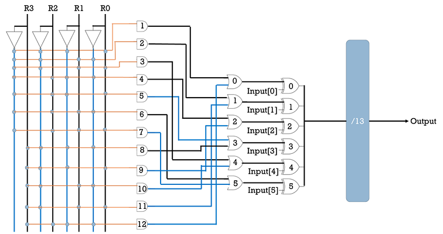
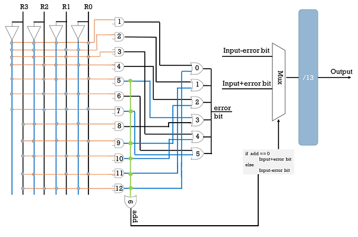
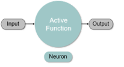
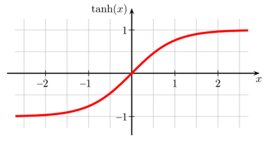
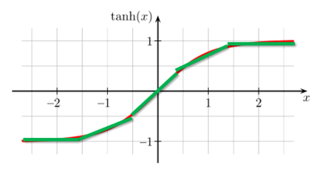
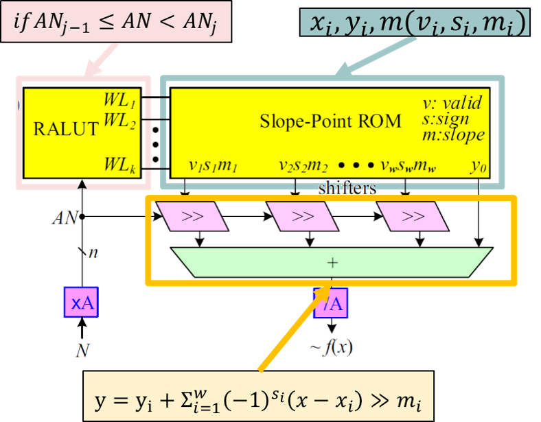

# This project is about my research.
* I'm [Ting-Yu Chen](https://github.com/Wilhelmine21/Wilhelmine21). 
* I'm from [Test Lab](http://testlab.ncue.edu.tw/tch/), Electronic Engineering, National Changhua University of Education.
* The title of my thesis is **AN Codes LS-PWL-RALUT**.

## AN Codes LS-PWL-RALUT
* AN codes --- [wiki](https://en.wikipedia.org/wiki/AN_codes) 
	 
	* AN codes是一個以整數A和N來命名的在線糾錯碼。運作方法是將我們要處理的數字N乘以我們選擇適合的模數A，經過一些計算後，除以A並解碼得到N。如果Mod A等於零，那代表這個數字是正確的，如果不是，那我們會需要回去查表去進行更正。
	* 我們使用Galois Field來創造一個數字環，這個環中的數字是通過乘以一定的倍數來計算的。
		* 例如，GF(7)可以使用x2或x3來創造數字環。但是我們不會使用x3的環，因為要處理的數字是二進制的，所以選擇2作為倍數。
			* 2 is a primitive element
				* GF(3)={0;1,2}
				* GF(5)={0;1,2,4,3}
				* GF(7)={0;1,2,4,3,6,5}
			* 3 is a primitive element
				* GF(7)={0;1,3,2,6,4,5} 
		
		* Example1(左下圖):
			* GF(13)從1開始，每個數依序乘以2後mod 13，然後我們可以得到13這個模數的數字環。
			* 當餘數為1時，就是2的0次方等於1，表示bit1是錯誤的；若餘數為2，也就是2的1次方，這代表bit2是錯誤的，依此類推，並且GF(13)的數字環必須包含1到12。如果不是，當餘數等於某一個不存在整數環中的數時，會無法確定要去糾正哪一個bit。
		
		* Example2(右下圖): 
			* GF(47)，這個數剛好可以形成兩個數字環，由+1和-1組成。這樣的好處是我們可以知道錯誤是來自加法還是減法，以此得到更廣的更正範圍。
					
		  
	* 為什麼我們使用AN codes而不是Hamming codes呢?
		* 因為漢明碼經過計算後，它的檢查位會被破壞，進而無法繼續具有更正錯誤的能力，而AN codes它可以經過計算後，依然具有更正錯誤的能力。
	* **4 Error Model**
		* 為了能夠有更好的更正效果，我們針對以下四種情況分別進行定義錯誤模型。
		* 1. **已知錯誤方向(Unidirectional)之完全非對稱模型**
			* 針對情況是事先已知錯誤會從1變0(Uni HL)或是從0變1(Uni LH)，此時模數A所對應的餘數環為單環，如下表。
			
				|Bit |11 |10 |9 |8 |7|6 |5 |4 |3 |2 |1 |0 |
				|:----:|:----:|:----:|:----:|:----:|:----:|:----:|:----:|:----:|:----:|:----:|:----:|:----:|
				|R+ |7 |10 |5 |9 |11 |12 |6 |3 |8 |4 |2 |1 |
				|R- |5 |3 |8 |4 |2 |1 |7 |10 |5 |9 |11 |12 |
			
			* 假設模數A為n 位元，可更正(n-1)位元的數字。以模數A=13為例，它可更正的位元數為12(包含模數A本身)，可更正的範圍是0到255的數(不含模數A)。
			* 由於已知錯誤方向，所以對應的餘數只有R+或R-，其解碼器電路如下圖。
				* 左圖=>錯誤會從1變0(Uni HL), 右圖=>錯誤會從0變1(Uni LH)
								
			  

		* 2. **未知錯誤方向(Alternative direction)之完全非對稱模型**
			* 針對情況是無法事先知道錯誤會從1變0或是從0變1，此時模數A所對應的餘數環為單環，如下表。
			
				|Bit |11 |10 |9 |8 |7|6 |5 |4 |3 |2 |1 |0 |
				|:----:|:----:|:----:|:----:|:----:|:----:|:----:|:----:|:----:|:----:|:----:|:----:|:----:|
				|R+ |7 |10 |5 |9 |11 |12 |6 |3 |8 |4 |2 |1 |
				|R- |5 |3 |8 |4 |2 |1 |7 |10 |5 |9 |11 |12 |
				
			* 餘數環會呈現像是莫比烏斯環，依據錯誤方向來對應錯誤位置，上表中的R+對應到0變1的錯誤方向；R-對應到1變0的錯誤方向。
			* 假設模數A為n 位元，可更正(n-1)位元的數字。以模數A=13為例，它可更正的位元數為12(包含模數A本身)，可更正的範圍是0到255的數(不含模數A)
			* 但是因為是未知錯誤方向，所以對應的餘數較多，其解碼器電路，如下圖，為四種模型中面積最大的。
			
			  
			
		* 3. **位元錯誤率模型(Bit Error Rate model, BER)**
			* 針對情況是電路受到干擾產生錯誤，由1變0或0變1，各有機率，此時模數A所對應的餘數環為雙環，如下表。
			
				|Bit  |5 |4 |3 |2 |1 |0 |
				|:----:|:----:|:----:|:----:|:----:|:----:|:----:|
				|s=0 |6 |3 |8 |4 |2 |1 |
				|s=1 |7 |10 |5 |9 |11 |12 |
			
			* 假設模數A為n位元，可更正(n-1)/2位元的數字。以模數A=13為例，它可更正的位元數為6(包含模數A本身)，可更正的範圍是0到3的數(不含模數A)，其解碼器電路如下圖。
			
			  
		
		* 4. **算術權重錯誤模型(Arithmetic Weight Error model, AWE)**
			* 針對情況是錯誤來自加法或減法，此時模數A所對應的餘數環為雙環，如下表。

				|Bit  |5 |4 |3 |2 |1 |0 |
				|:----:|:----:|:----:|:----:|:----:|:----:|:----:|
				|s=0 |6 |3 |8 |4 |2 |1 |
				|s=1 |7 |10 |5 |9 |11 |12 |

			* 透過上表的餘數對應，我們可以得知當s=0，代表錯誤來自加法；當s=1，代表錯誤來自減法。
			* 假設模數A為n位元，可更正(n-1)/2位元的數字。以模數A=13為例，它可更正的位元數為6(包含模數A本身)，可更正的範圍是0到3的數(不含模數A)
			* 其解碼器電路如下圖，不同於BER模型，AWE有圖7中的add來檢查錯誤來自加法或減法。
			
			  

* Light Number
	* 那什麼是Light Number？簡單來說，它就是一個算術權重小的數字。Light Number是由2的次方數來進行加減來得出的。
	* Example:

		  
	
		|s1 |m1 |s2 |m2 |s3 |m3|
		|:----:|:----:|:----:|:----:|:----:|:----:|
		|+ |0 |+ |-1 |+ |-3|
		|+ |-1 |- |-3 |+ |-4|
		
## 題目說明
  
	
* 為什麼要使用查表及AN codes?	
	*  關於神經網絡中的激勵函數和量化，我們可能會遇到需要應用於任何函數的情況，並且它可能具有各種函數，那這些函數可能是複雜的，也可能是無法被符號積分微分的函數。 在這種情況下，最合適的方法是使用`查表`。
	*  對於傳統的查表，它有幾個缺點。首先是它需要記憶體去記錄，並使用了ROM。第二個是它記錄的數量非常大。因此，有些人使用PWL和RALUT來解決這些問題，但是對於第一個PWL來說，它需要乘法器，而這會佔用面積；然後對於第二個RALUT來說，它記錄的數量仍然很多。
	*  因此，我們可以使用*輕數斜率(Light Slope)* 來改善這兩個缺點，那我們提出的方法是`輕數斜率分段線性範圍可循址查表(LS-PWL RALUT)`。
	*  隨著科技的發展，越來越多電動汽車使用神經網絡進行訓練，讓汽車得以自動駕駛。但是，我們時不時聽到有關於自動駕駛汽車的車禍事故。因此，提高神經網絡的可靠度是非常重要的。
	*  對於神經網絡的前幾層它具有自我修復的作用，但是對於最後一層它具有決定性的作用。最後一層的激勵函數通常不是像ReLU這樣簡單的函數，而是複雜的函數，那更應該使用查表去處理。但是由於來自通道或運算的雜訊，這一層很容易受到影響而錯誤。因此，為了能夠更正錯誤，我們添加了AN codes以提高神經網絡的可靠度。

* 如何使用移位而不用乘法?	
	*  下圖是一個tanh(x)的圖，它是一個常見的激勵函數
		  
	*  那我們的方法會對它進行線性分段，而這個分段的線段就可以用點斜式來表示
		  
	*  由於乘法會需要花費面積和時間，所以我們將斜率K替換成Light Number，這樣就可以使用移位的方式來完成這個式子，而不需要使用乘法器。
		  

* AN codes LS-PWL-RALUT模型與結構圖
	  
	* 將輸入值N乘以A，進入比較範圍，然後只有一條Word Line會被enable
	* 在ROM中查到對應的值，出來進行移位和加總，然後得到查表的輸出
	* 將其除以A，然後對其進行解碼以進行更正，最後獲得正確的值。

---
## My Project GUI
* 我做了一個GUI用來展示我的題目
* 我的GUI分為 3 個部分來運行
	* 1. [AN codes](https://github.com/Wilhelmine21/Wilhelmine21/edit/MyNCUE/MyProject_GUI/Readme.md#1-an-codes-and-decoder)
	* 2. [ANRCAM](https://github.com/Wilhelmine21/Wilhelmine21/edit/MyNCUE/MyProject_GUI/Readme.md#2-anrcam)
	* 3. [EDA](https://github.com/Wilhelmine21/Wilhelmine21/edit/MyNCUE/MyProject_GUI/Readme.md#3-eda)
* 環境
	*  Verilog: [iVerilog](http://iverilog.icarus.com/), [GTKwave](http://gtkwave.sourceforge.net/)
	*  EDA: Design Comilper, IC Compiler

* 版本及檔案說明、影片連結
	* Windows版本 --- [Link]()
		* GUI_ALL.exe (執行檔)
		* 目前版本無須額外檔案
		* EDA功能不能使用
	* Linux版本 --- [Link]()
		* GUI_ALL_linux (執行檔)
		* EDA_add_files_GUI.tar (執行自動化繞線所需的額外檔案)
	* Demo Video
		* a. Windows 10 version --- [video](https://www.youtube.com/watch?v=kXfVsiijhno)
		* b. Linux (Centos 7) version --- [video](https://www.youtube.com/watch?v=Rb99CHsb28k) 

###  My Research

* 上圖(左)為Win10版本的GUI, 上圖(右)為Linux(Centos 7)版本的GUI.
* 主要展示 `題目名稱`, `作者名稱`, `實驗室系所學校`和`摘要`
* 下方三個按鈕分別對應不同的project.

* 上方選單File:  
	
	* (1) Open file: 開啟舊檔
	* (2) Exit: 關閉程式
	* (3) Quit: 關閉程式並關閉後台 ⬅ 當程式當機時，可由此嘗試關閉.

* 上方選單Help:   
	
	
	* (1) Demo Video: 連接到Youtube的所有功能說明及展示之影片
		* a. Windows 10 version --- [video](https://www.youtube.com/watch?v=kXfVsiijhno)
		* b. Linux (Centos 7) version --- [video](https://www.youtube.com/watch?v=Rb99CHsb28k)
	
	* (2) About: 顯示此程式的相關資訊  
		
---
#### 1. AN codes and decoder

* 這個Project主要用來生成AN codes解碼器(Verilog file)
* Step 1. 找到可用的A
	* (1) 輸入範圍 
		* 需大於10
	* (2) 選擇錯誤模型
		* Uni HL: 單一錯誤方向之完全非對稱模型(錯誤由1變0)
		* Uni LH: 單一錯誤方向之完全非對稱模型(錯誤由0變1)
		* Alter: 未知錯誤方向之完全非對稱模型
		* BER: Bit Error Rate model
		* AWE: Arithmetic Weight Error model
	* (3) A maybe欄位會展示出範圍內可用的A
* Step 2. 生成Verilog檔案
	* (1) 在Select A輸入想要的A值
		* 此值須為A maybe欄位中出現過的數字
	* (2) 按下`Gen & Show`，即可在select A下方的文字框看見生成的檔案內容  
	  
	* (3) 若是看不清楚，可使用上方選單File->Open File... 開啟檔案查看  
	  
* Step 3. Verilog 驗證
	* 這個功能使用[iVerilog](http://iverilog.icarus.com)和[GTKwave](http://gtkwave.sourceforge.net)來進行驗證
	* testbench會隨解碼器檔一起生成
		* 對同一個數字做不同bit錯誤 
		* 只要Output的數字一樣即為更正成功
	
		
***
* 上方的選單Help: 
 	 
	* 前兩項會連結到iVerilog和GTKwave的官網
	* 第三項 Error Model Descripton為錯誤模型的簡單說明及電路圖
		* 會根據Error Model選擇的不同而有改變說明 
		
		 
	
	* 第四項Video則為AN codes這個project展示與說明的影片
	* 最後About會顯示程式資訊 
		
*** 
	
#### 2. ANRCAM
 

* 介面功能介紹
	
---

#### 3. EDA
 
* 第三個Project是用來做自動化繞線佈局
* 此功能僅能在工作站運行, 因此無windows版本
* 需要額外的檔案 --- `EDA_add_files_GUI.tar`
	* 開始GUI前須先解壓縮此檔案
	
		 
	* 第一排按鈕
		* Layout: 自動化佈局, 使用`Design Compiler`和`IC Compiler`
		* DRC: Design Rule Check 驗證
		* LVS: Layout Versus schematic 驗證
	* 第二排按鈕
		* About會顯示程式資訊
	
		 

	*	
		* Open file 開啟舊檔
		* Exit 關閉程式
