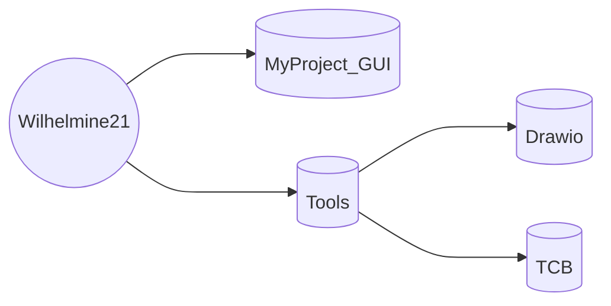
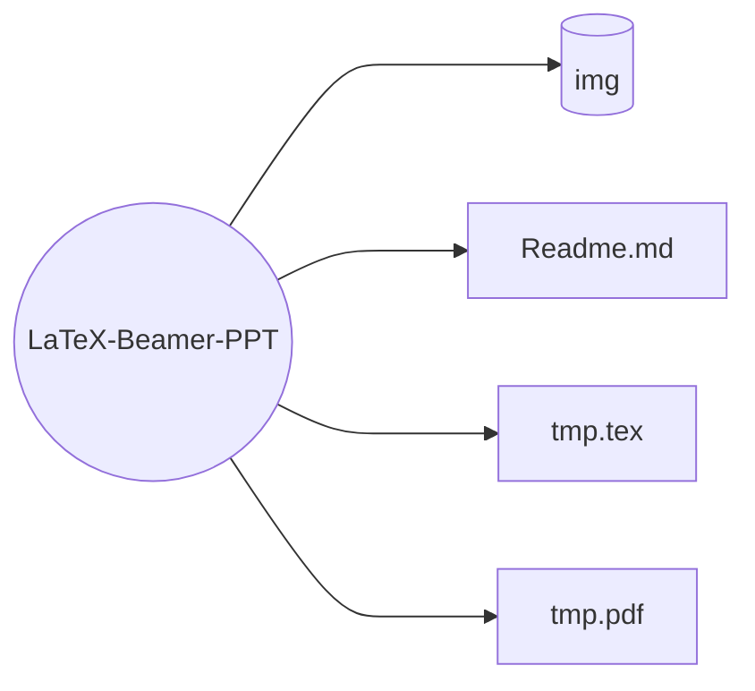
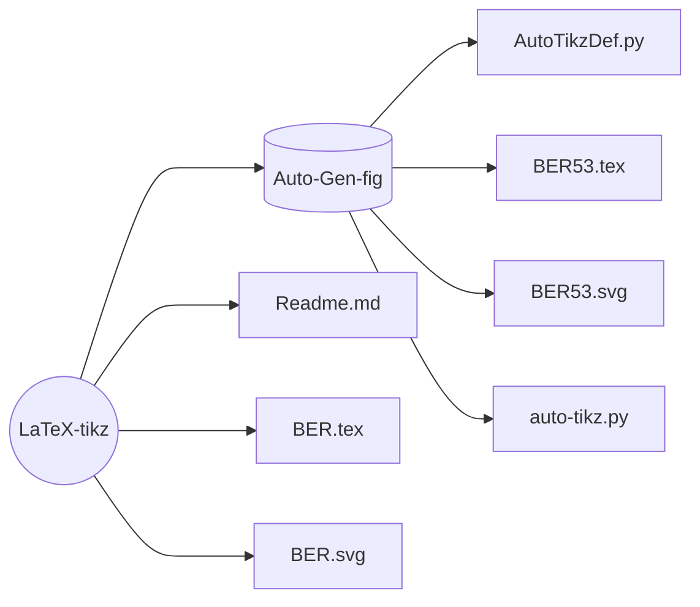
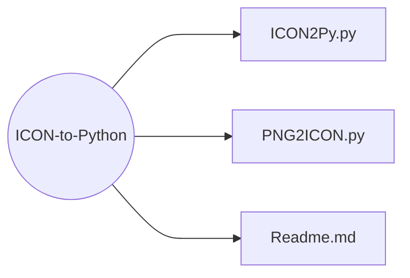
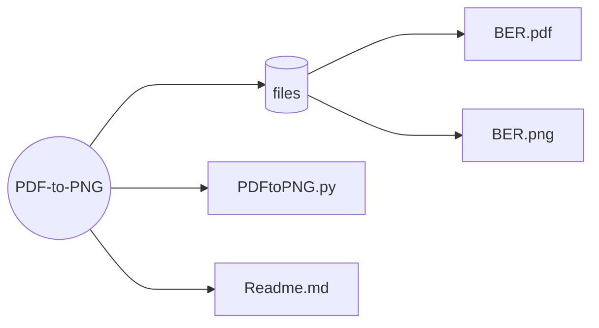
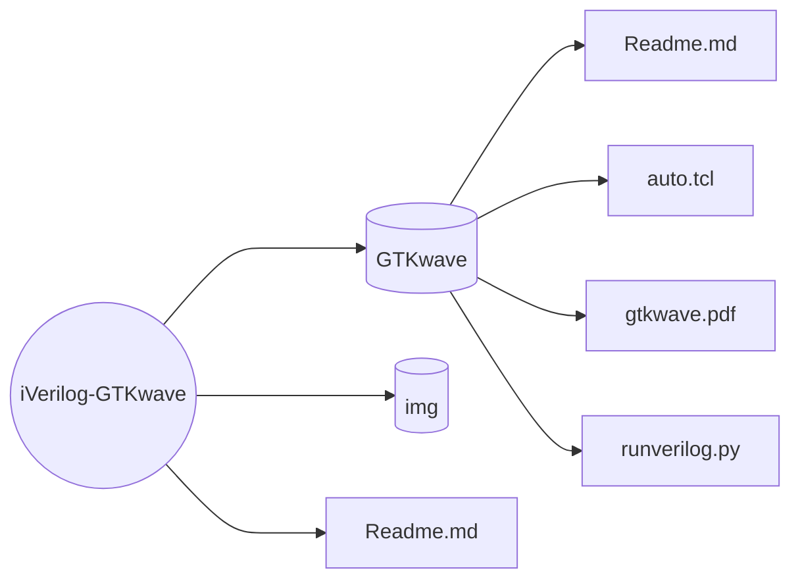
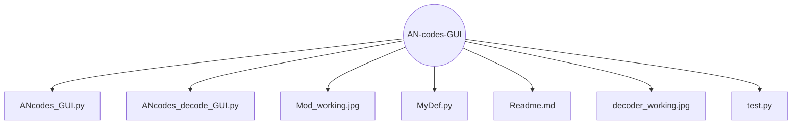
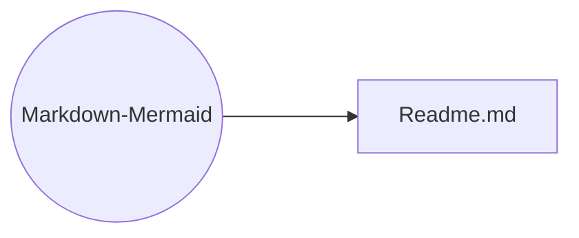
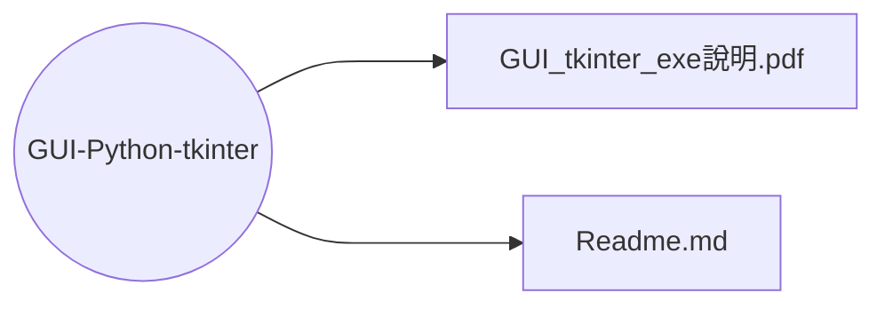

# About Me
- 👋 Hi, I’m Ting-Yu Chen.
- I'm from [Test Lab](http://testlab.ncue.edu.tw/tch/), Electronic Engineering, National Changhua University of Education.

## Repository-[Wilhelmine21](https://github.com/Wilhelmine21/Wilhelmine21)
### Folder tree

* I.   **[MyProject_GUI](https://github.com/Wilhelmine21/Wilhelmine21/tree/main/MyProject_GUI "MyProject_GUI")**

* II.   **[Tools](https://github.com/Wilhelmine21/Wilhelmine21/tree/main/Tools "Tools")** : Various commonly used programs and files
	* 1. **[Drawio](https://github.com/Wilhelmine21/Wilhelmine21/tree/main/Tools/Drawio "Drawio")** : Put the file drawn by [draw.io](https://app.diagrams.net/)
			
	* 2. **[TCB](https://github.com/Wilhelmine21/Wilhelmine21/tree/main/Tools/TCB "TCB")** : Convert multiplication to shift and addition
### Releases
* [About Release](https://github.com/Wilhelmine21/Wilhelmine21/blob/main/MyProject_GUI/Releases(GUI).md#releases)

##  Repository-[LaTeX-Beamer-PPT](https://github.com/Wilhelmine21/LaTeX-Beamer-PPT)
### Folder tree

* How to create a PPT using LaTeX

##  Repository-[LaTeX-tikz](https://github.com/Wilhelmine21/LaTeX-tikz)
### Folder tree

* Generate pictures using LaTeX
* Automatically generate program files and sample drawings

##  Repository-[ICON-to-Python](https://github.com/Wilhelmine21/ICON-to-Python)
### Folder tree

* Convert the icon file to a python file so that it can be packaged into an exe file by pyinstaller

##  Repository-[PDF-to-PNG](https://github.com/Wilhelmine21/PDF-to-PNG)
### Folder tree

* Convert PDF to PNG, easy to convert pdf generated by TeX file to png

##  Repository-[iVerilog-GTKwave](https://github.com/Wilhelmine21/iVerilog-GTKwave)
### Folder tree

* iVerilog and GTKwave

##  Repository-[AN-codes-Decoder](https://github.com/Wilhelmine21/AN-codes-Decoder)
### Folder tree
```mermaid
graph LR;
AN-codes-Decoder((AN-codes-Decoder)) ---> Old_versions[(Old_versions)]
AN-codes-Decoder ---> files[(files)]
AN-codes-Decoder ---> img[(img)]
AN-codes-Decoder ---> 4ErrorMode_ver3.py
AN-codes-Decoder ---> Readme.md
AN-codes-Decoder ---> auto.tcl
AN-codes-Decoder ---> auto_Alter.tcl
AN-codes-Decoder ---> ver3_def.py

Old_versions ---> 2022-10-05 14.07.31.png
Old_versions ---> 4ErrorMode_ver2.py
Old_versions ---> Readme.md
Old_versions ---> v3_step3_2.png
```
* AN codes decoder automatically generates verification

##  Repository-[AN-codes-GUI](https://github.com/Wilhelmine21/AN-codes-GUI)
### Folder tree

* Use GUI to show how AN codes work

##  Repository-[Markdown-Mermaid](https://github.com/Wilhelmine21/Markdown-Mermaid)
### Folder tree

* Used to display flowcharts in Markdown

##  Repository-[GUI-Python-tkinter](https://github.com/Wilhelmine21/GUI-Python-tkinter)
### Folder tree

* How to use tkinter and pyinstaller

# Wilhelmine's GitHub Stats
[](https://github.com/Wilhelmine21/github-readme-stats&theme=merko)
## Most Used Languages
[](https://github.com/Wilhelmine21/github-readme-stats&theme=highcontrast)
## My toolbox 
[](https://code.visualstudio.com/) &nbsp;[](https://www.python.org/) &nbsp;[](https://icons8.com/icons/set/linux)
* Python, Linux Icon by [Icons8](https://icons8.com/)