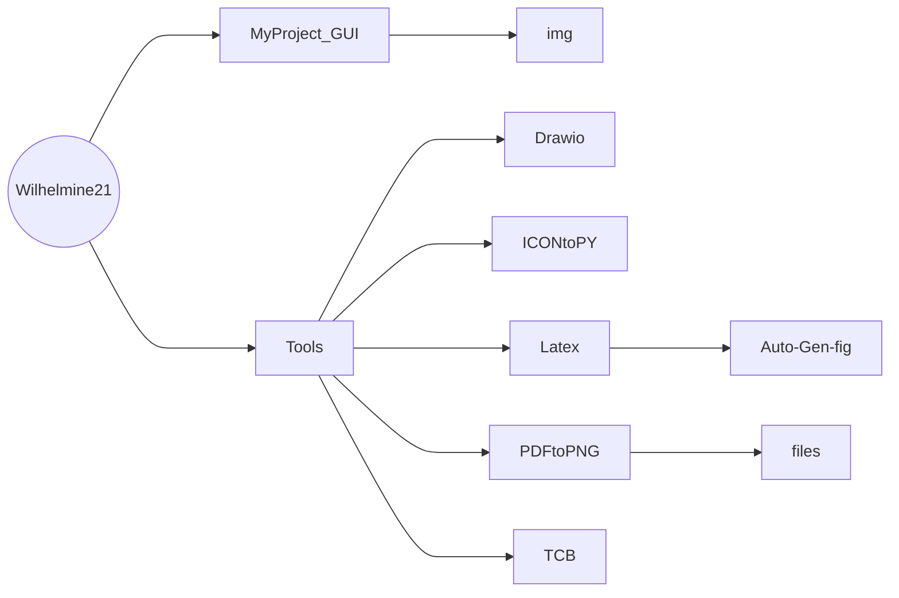

# About Me
- 👋 Hi, I’m Ting-Yu Chen.
- I'm from [Test Lab](http://testlab.ncue.edu.tw/tch/), Electronic Engineering, National Changhua University of Education.
---
## Folder & Files
* Folder tree

*  Folders and file descriptions(**folders shown in bold**)
	*   **[MyProject_GUI](https://github.com/Wilhelmine21/Wilhelmine21/tree/main/MyProject_GUI "MyProject_GUI")**
		*   **[img](https://github.com/Wilhelmine21/Wilhelmine21/tree/main/MyProject_GUI/img "img")** : pictures for explain
		*  [Readme.md](https://github.com/Wilhelmine21/Wilhelmine21/blob/main/MyProject_GUI/Readme.md "Readme.md") : Explain the purpose and usage of the entire Project
		
	*   **[Tools](https://github.com/Wilhelmine21/Wilhelmine21/tree/main/Tools "Tools")** : Various commonly used programs and files
		*   **[Drawio](https://github.com/Wilhelmine21/Wilhelmine21/tree/main/Tools/Drawio "Drawio")** : Put the file drawn by [draw.io](https://app.diagrams.net/)
			*   [ANRCAM_flow](https://github.com/Wilhelmine21/Wilhelmine21/blob/main/Tools/Drawio/ANRCAM_flow "ANRCAM_flow")
			*   [BLER](https://github.com/Wilhelmine21/Wilhelmine21/blob/main/Tools/Drawio/BLER "BLER")
			*   [flow.drawio](https://github.com/Wilhelmine21/Wilhelmine21/blob/main/Tools/Drawio/flow.drawio "flow.drawio")
			*   [thesisflow](https://github.com/Wilhelmine21/Wilhelmine21/blob/main/Tools/Drawio/thesisflow "thesisflow")
		*   **[ICONtoPy](https://github.com/Wilhelmine21/Wilhelmine21/tree/main/Tools/ICONtoPy "ICONtoPy")**: Convert the icon file to a python file so that it can be packaged into an exe file by pyinstaller
			*   [Readme.md](https://github.com/Wilhelmine21/Wilhelmine21/blob/main/Tools/ICONtoPy/Readme.md "Readme.md")
			*   [trans.py](https://github.com/Wilhelmine21/Wilhelmine21/blob/main/Tools/ICONtoPy/trans.py "trans.py")
		*   **[Latex](https://github.com/Wilhelmine21/Wilhelmine21/tree/main/Tools/Latex "Latex")** : Generate pictures using LaTeX
			*   **[Auto-Gen-fig](https://github.com/Wilhelmine21/Wilhelmine21/tree/main/Tools/Latex/Auto-Gen-fig "Auto-Gen-fig")** : Automatically generate program files and sample drawings
			*   [BER.svg](https://github.com/Wilhelmine21/Wilhelmine21/blob/main/Tools/Latex/BER.svg "BER.svg")
			*   [BER.tex](https://github.com/Wilhelmine21/Wilhelmine21/blob/main/Tools/Latex/BER.tex "BER.tex")
			*   [Readme.md](https://github.com/Wilhelmine21/Wilhelmine21/blob/main/Tools/Latex/Readme.md "Readme.md")
			
		*   **[PDFtoPNG](https://github.com/Wilhelmine21/Wilhelmine21/tree/main/Tools/PDFtoPNG "PDFtoPNG")** : Convert PDF to PNG, easy to convert pdf generated by TeX file to png
			*   **[files](https://github.com/Wilhelmine21/Wilhelmine21/tree/main/Tools/PDFtoPNG/files "files")** : sample files
			*   [PDFtoPNG.py](https://github.com/Wilhelmine21/Wilhelmine21/blob/main/Tools/PDFtoPNG/PDFtoPNG.py "PDFtoPNG.py")
			*   [Readme.md](https://github.com/Wilhelmine21/Wilhelmine21/blob/main/Tools/PDFtoPNG/Readme.md "Readme.md")
			
		*   **[TCB](https://github.com/Wilhelmine21/Wilhelmine21/tree/main/Tools/TCB "TCB")** : Convert multiplication to shift and addition
		*   [Readme.md](https://github.com/Wilhelmine21/Wilhelmine21/blob/main/Tools/TCB/Readme.md "Readme.md")
		*   [TCB.py](https://github.com/Wilhelmine21/Wilhelmine21/blob/main/Tools/TCB/TCB.py "TCB.py")

## Releases
* [About Release](https://github.com/Wilhelmine21/Wilhelmine21/blob/main/MyProject_GUI/Releases(GUI).md#releases)
