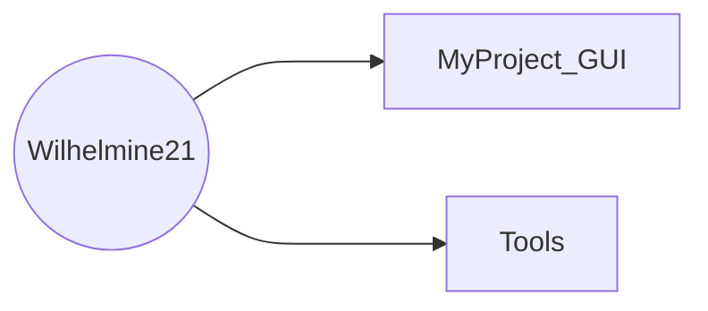

# About Me
- 👋 Hi, I’m Ting-Yu Chen.
- I'm from [Test Lab](http://testlab.ncue.edu.tw/tch/), Electronic Engineering, National Changhua University of Education.
---
## Folders & Files
* Folder tree

*  Folder and file descriptions(**folders shown in bold**)
	* I.   **[MyProject_GUI](https://github.com/Wilhelmine21/Wilhelmine21/tree/main/MyProject_GUI "MyProject_GUI")**

	* II.   **[Tools](https://github.com/Wilhelmine21/Wilhelmine21/tree/main/Tools "Tools")** : Various commonly used programs and files
		* 1. **[Drawio](https://github.com/Wilhelmine21/Wilhelmine21/tree/main/Tools/Drawio "Drawio")** : Put the file drawn by [draw.io](https://app.diagrams.net/)
			
		* 2. **[TCB](https://github.com/Wilhelmine21/Wilhelmine21/tree/main/Tools/TCB "TCB")** : Convert multiplication to shift and addition
		

## Releases
* [About Release](https://github.com/Wilhelmine21/Wilhelmine21/blob/main/MyProject_GUI/Releases(GUI).md#releases)

# Wilhelmine's GitHub Stats

## Most Used Languages

## My toolbox 
 &nbsp; &nbsp;
* Python, Linux Icon by [Icons8](https://icons8.com/)