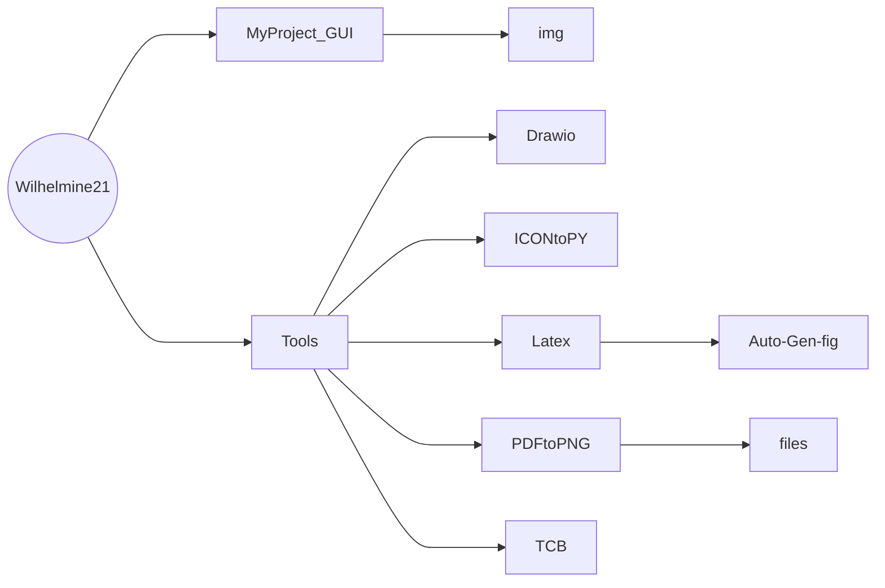

# About Me
- 👋 Hi, I’m Ting-Yu Chen.
- I'm from [Test Lab](http://testlab.ncue.edu.tw/tch/), Electronic Engineering, National Changhua University of Education.
---
## Folder & Files
* Folder tree

*  資料夾與檔案說明(**粗體為資料夾**)

	*   **MyProject_GUI**
		*   **img** : 說明用圖片
		*  [Readme.md](https://github.com/Wilhelmine21/Wilhelmine21/blob/main/MyProject_GUI/Readme.md "Readme.md") : 說明整個Project的目的與使用說明
		
	*   **Tools** : 各種常用到的程式與檔案
		*   **Drawio** : 放[draw.io](https://app.diagrams.net/)所繪製的檔案
			*   [ANRCAM_flow](https://github.com/Wilhelmine21/Wilhelmine21/blob/main/Tools/Drawio/ANRCAM_flow "ANRCAM_flow")
			*   [BLER](https://github.com/Wilhelmine21/Wilhelmine21/blob/main/Tools/Drawio/BLER "BLER")
			*   [flow.drawio](https://github.com/Wilhelmine21/Wilhelmine21/blob/main/Tools/Drawio/flow.drawio "flow.drawio")
			*   [thesisflow](https://github.com/Wilhelmine21/Wilhelmine21/blob/main/Tools/Drawio/thesisflow "thesisflow")
		*   **ICONtoPY**: 將icon檔轉成python檔，以便被pyinstaller包成一個exe檔
			*   [Readme.md](https://github.com/Wilhelmine21/Wilhelmine21/blob/main/Tools/ICONtoPy/Readme.md "Readme.md")
			*   [trans.py](https://github.com/Wilhelmine21/Wilhelmine21/blob/main/Tools/ICONtoPy/trans.py "trans.py")
		*   **Latex** : 使用LaTeX語法生成圖片
			*   **Auto-Gen-fig** : 自動生成程式檔與範例圖檔
			*   [BER.svg](https://github.com/Wilhelmine21/Wilhelmine21/blob/main/Tools/Latex/BER.svg "BER.svg")
			*   [BER.tex](https://github.com/Wilhelmine21/Wilhelmine21/blob/main/Tools/Latex/BER.tex "BER.tex")
			*   [Readme.md](https://github.com/Wilhelmine21/Wilhelmine21/blob/main/Tools/Latex/Readme.md "Readme.md")
			
		*   **PDFtoPNG** : 將PDF轉成PNG，方便將TeX檔所生成的pdf轉成png
			*   **files** : 範例圖檔
			*   [PDFtoPNG.py](https://github.com/Wilhelmine21/Wilhelmine21/blob/main/Tools/PDFtoPNG/PDFtoPNG.py "PDFtoPNG.py")
			*   [Readme.md](https://github.com/Wilhelmine21/Wilhelmine21/blob/main/Tools/PDFtoPNG/Readme.md "Readme.md")
			
		*   **TCB** : 將乘法轉成移位和加法
		*   [Readme.md](https://github.com/Wilhelmine21/Wilhelmine21/blob/main/Tools/TCB/Readme.md "Readme.md")
		*   [TCB.py](https://github.com/Wilhelmine21/Wilhelmine21/blob/main/Tools/TCB/TCB.py "TCB.py")

## Releases
* [About Release](https://github.com/Wilhelmine21/Wilhelmine21/blob/main/MyProject_GUI/Releases(GUI).md#releases)
