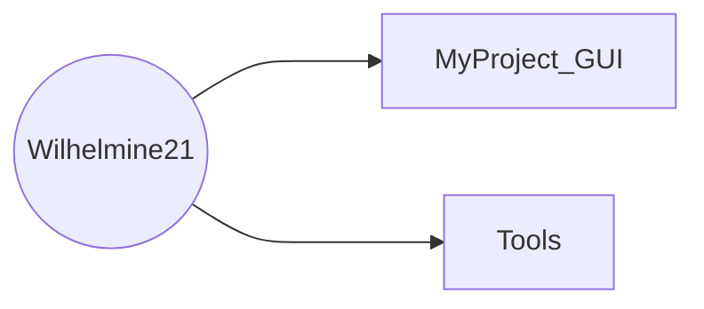

# About Me
- 👋 Hi, I’m Ting-Yu Chen.
- I'm from [Test Lab](http://testlab.ncue.edu.tw/tch/), Electronic Engineering, National Changhua University of Education.
---
## Folders & Files
* Folder tree

*  Folder and file descriptions(**folders shown in bold**)
	* I.   **[MyProject_GUI](https://github.com/Wilhelmine21/Wilhelmine21/tree/main/MyProject_GUI "MyProject_GUI")**

	* II.   **[Tools](https://github.com/Wilhelmine21/Wilhelmine21/tree/main/Tools "Tools")** : Various commonly used programs and files
		* 1. **[Drawio](https://github.com/Wilhelmine21/Wilhelmine21/tree/main/Tools/Drawio "Drawio")** : Put the file drawn by [draw.io](https://app.diagrams.net/)
		
		* 2. **[GUI(Python-tk)](https://github.com/Wilhelmine21/Wilhelmine21/tree/main/Tools/GUI(Python-tk))**: Teach how to use tkinter and pyinstaller
		
		* 3. **[ICONtoPy](https://github.com/Wilhelmine21/Wilhelmine21/tree/main/Tools/ICONtoPy "ICONtoPy")**: Convert the icon file to a python file so that it can be packaged into an exe file by pyinstaller

		* 4. **[Latex](https://github.com/Wilhelmine21/Wilhelmine21/tree/main/Tools/Latex "Latex")** : Generate pictures using LaTeX
				*   **[Auto-Gen-fig](https://github.com/Wilhelmine21/Wilhelmine21/tree/main/Tools/Latex/Auto-Gen-fig "Auto-Gen-fig")** : Automatically generate program files and sample drawings

		* 5. **[Mermaid](https://github.com/Wilhelmine21/Wilhelmine21/tree/main/Tools/Mermaid "Mermaid")**: Used to display flowcharts in Makedown
		
		* 6. **[PDFtoPNG](https://github.com/Wilhelmine21/Wilhelmine21/tree/main/Tools/PDFtoPNG "PDFtoPNG")** : Convert PDF to PNG, easy to convert pdf generated by TeX file to png
			
		* 7. **[TCB](https://github.com/Wilhelmine21/Wilhelmine21/tree/main/Tools/TCB "TCB")** : Convert multiplication to shift and addition
		
		* 8. **[Verilog](https://github.com/Wilhelmine21/Wilhelmine21/tree/main/Tools/Verilog)**: iVerilog and GTKwave
				*   **[ANcodes-GUI](https://github.com/Wilhelmine21/Wilhelmine21/tree/main/Tools/Verilog/ANcodes-GUI)** : Use GUI to show how AN codes work
				*   **[ANcodesDecoder](https://github.com/Wilhelmine21/Wilhelmine21/tree/main/Tools/Verilog/ANcodesDecoder)** : AN codes decoder automatically generates verification
				*   **[GTKWave](https://github.com/Wilhelmine21/Wilhelmine21/tree/main/Tools/Verilog/GTKWave)** : GTKWave automation commands

## Releases
* [About Release](https://github.com/Wilhelmine21/Wilhelmine21/blob/main/MyProject_GUI/Releases(GUI).md#releases)

# Wilhelmine's GitHub Stats

## My toolbox
 