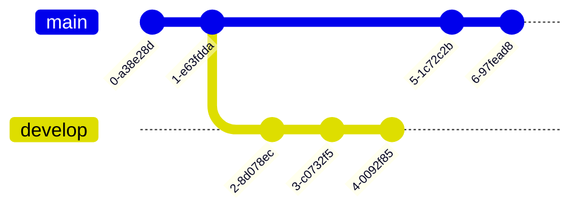

# Mermaid 
* 用來在Makedown裡顯示流程圖之類。
* 程式來源 --- [Link](https://mermaid-js.github.io/mermaid/#/)

## 流程圖(Flowchat)
* 程式碼
```
graph TD;
    A-->B;
    A-->C;
    B-->D;
    C-->D;
```

* 圖


## 時序圖(Sequence Diagram)
* 程式碼
```
sequenceDiagram
    participant Alice
    participant Bob
    Alice->>John: Hello John, how are you?
    loop Healthcheck
        John->>John: Fight against hypochondria
    end
    Note right of John: Rational thoughts <br/>prevail!
    John-->>Alice: Great!
    John->>Bob: How about you?
    Bob-->>John: Jolly good!
```
    
* 圖


## 甘特圖(Gantt Diagram)
* 程式碼
```
gantt
dateFormat  YYYY-MM-DD
title Adding GANTT diagram to mermaid
excludes weekdays 2014-01-10

section A section
Completed task            :done,    des1, 2014-01-06,2014-01-08
Active task               :active,  des2, 2014-01-09, 3d
Future task               :         des3, after des2, 5d
Future task2               :         des4, after des3, 5d
```

* 圖


## 類別圖(Class diagram)
* 程式碼
```
classDiagram
Class01 <|-- AveryLongClass : Cool
Class03 *-- Class04
Class05 o-- Class06
Class07 .. Class08
Class09 --> C2 : Where am i?
Class09 --* C3
Class09 --|> Class07
Class07 : equals()
Class07 : Object[] elementData
Class01 : size()
Class01 : int chimp
Class01 : int gorilla
Class08 <--> C2: Cool label
```

* 圖


## Git圖(Git graph)
* 程式碼
```
    gitGraph
       commit
       commit
       branch develop
       commit
       commit
       commit
       checkout main
       commit
       commit
```

* 圖


## 實體關係圖(Entity Relationship Diagram - exclamation experimental)
* 程式碼
```
erDiagram
    CUSTOMER ||--o{ ORDER : places
    ORDER ||--|{ LINE-ITEM : contains
    CUSTOMER }|..|{ DELIVERY-ADDRESS : uses
```

* 圖


## 日程規畫圖(User Journey Diagram)
* 範例一
  * 程式碼
  ```
  journey
      title My working day
      section Go to work
        Make tea: 5: Me
        Go upstairs: 3: Me
        Do work: 1: Me, Cat
      section Go home
        Go downstairs: 5: Me
        Sit down: 5: Me
  ```

  * 圖
  ```mermaid
  journey
      title My working day
      section Go to work
        Make tea: 5: Me
        Go upstairs: 3: Me
        Do work: 1: Me, Cat
      section Go home
        Go downstairs: 5: Me
        Sit down: 5: Me
  ```
* 範例二
  * 程式碼
  ```
  erDiagram
      CAR ||--o{ NAMED-DRIVER : allows
      CAR {
          string allowedDriver FK "The license of the allowed driver"
          string registrationNumber
          string make
          string model
      }
      PERSON ||--o{ NAMED-DRIVER : is
      PERSON {
          string driversLicense PK "The license #"
          string firstName
          string lastName
          int age
      }
  ```

  * 圖
  ```mermaid
  erDiagram
      CAR ||--o{ NAMED-DRIVER : allows
      CAR {
          string allowedDriver FK "The license of the allowed driver"
          string registrationNumber
          string make
          string model
      }
      PERSON ||--o{ NAMED-DRIVER : is
      PERSON {
          string driversLicense PK "The license #"
          string firstName
          string lastName
          int age
      }
  ```
  
## 圓餅圖(Pie Chart Diagram)
* 語法
> [pie] [showData] (OPTIONAL) [title] [titlevalue] (OPTIONAL) "[datakey1]" : [dataValue1] "[datakey2]" : [dataValue2] "[datakey3]" : [dataValue3] 
* 範例一
  * 程式碼
  ```
  pie title Pets adopted by volunteers
      "Dogs" : 386
      "Cats" : 85
      "Rats" : 15
  ```

  * 圖
  ```mermaid
  pie title Pets adopted by volunteers
      "Dogs" : 386
      "Cats" : 85
      "Rats" : 15
  ```
* 範例二
  * 程式碼
  ```
  pie showData
      title Key elements in Product X
      "Calcium" : 42.96
      "Potassium" : 50.05
      "Magnesium" : 10.01
      "Iron" :  5
  ```

  * 圖
  ```mermaid
  pie showData
      title Key elements in Product X
      "Calcium" : 42.96
      "Potassium" : 50.05
      "Magnesium" : 10.01
      "Iron" :  5
  ```
  
## State圖(State Diagram)
* 範例一
  * 程式碼
  ```
  stateDiagram-v2
      [*] --> Still
      Still --> [*]

      Still --> Moving
      Moving --> Still
      Moving --> Crash
      Crash --> [*]
  ```

  * 圖
  ```mermaid
  stateDiagram-v2
      [*] --> Still
      Still --> [*]

      Still --> Moving
      Moving --> Still
      Moving --> Crash
      Crash --> [*]
  ```
* 範例二
  * 程式碼
  ```
  stateDiagram-v2
      [*] --> s1
      s1 --> s2: A transition
      s1 --> [*]
  ```

  * 圖
  ```mermaid
  stateDiagram-v2
      [*] --> s1
      s1 --> s2: A transition
      s1 --> [*]
  ```
* 範例三(Composite states)
  * 程式碼
  ```
  stateDiagram-v2
      [*] --> First
      state First {
          [*] --> second
          second --> [*]
      }
  ```

  * 圖
  ```mermaid
  stateDiagram-v2
      [*] --> First
      state First {
          [*] --> second
          second --> [*]
      }
  ```
* 範例四
  * 程式碼
  ```
  stateDiagram-v2
      [*] --> First

      state First {
          [*] --> Second

          state Second {
              [*] --> second
              second --> Third

              state Third {
                  [*] --> third
                  third --> [*]
              }
          }
      }
  ```

  * 圖
  ```mermaid
  stateDiagram-v2
      [*] --> First

      state First {
          [*] --> Second

          state Second {
              [*] --> second
              second --> Third

              state Third {
                  [*] --> third
                  third --> [*]
              }
          }
      }
  ```
* 範例五
  * 程式碼
  ```
  stateDiagram-v2
      [*] --> First
      First --> Second
      First --> Third

      state First {
          [*] --> fir
          fir --> [*]
      }
      state Second {
          [*] --> sec
          sec --> [*]
      }
      state Third {
          [*] --> thi
          thi --> [*]
      }
  ```

  * 圖
  ```mermaid
  stateDiagram-v2
      [*] --> First
      First --> Second
      First --> Third

      state First {
          [*] --> fir
          fir --> [*]
      }
      state Second {
          [*] --> sec
          sec --> [*]
      }
      state Third {
          [*] --> thi
          thi --> [*]
      }
  ```
* 範例六
  * 程式碼
  ```
  stateDiagram-v2
      state if_state <<choice>>
      [*] --> IsPositive
      IsPositive --> if_state
      if_state --> False: if n < 0
      if_state --> True : if n >= 0
  ```

  * 圖
  ```mermaid
  stateDiagram-v2
      state if_state <<choice>>
      [*] --> IsPositive
      IsPositive --> if_state
      if_state --> False: if n < 0
      if_state --> True : if n >= 0
  ```  
* 範例七(Forks)
  * 程式碼
  ```
     stateDiagram-v2
      state fork_state <<fork>>
        [*] --> fork_state
        fork_state --> State2
        fork_state --> State3

        state join_state <<join>>
        State2 --> join_state
        State3 --> join_state
        join_state --> State4
        State4 --> [*]
  ```

  * 圖
  ```mermaid
     stateDiagram-v2
      state fork_state <<fork>>
        [*] --> fork_state
        fork_state --> State2
        fork_state --> State3

        state join_state <<join>>
        State2 --> join_state
        State3 --> join_state
        join_state --> State4
        State4 --> [*]
  ```  
* 範例八
  * 程式碼
  ```
      stateDiagram-v2
          State1: The state with a note
          note right of State1
              Important information! You can write
              notes.
          end note
          State1 --> State2
          note left of State2 : This is the note to the left.
  ```

  * 圖
  ```mermaid
      stateDiagram-v2
          State1: The state with a note
          note right of State1
              Important information! You can write
              notes.
          end note
          State1 --> State2
          note left of State2 : This is the note to the left.
  ```  
* 範例九
  * 程式碼
  ```
  stateDiagram-v2
      [*] --> Active

      state Active {
          [*] --> NumLockOff
          NumLockOff --> NumLockOn : EvNumLockPressed
          NumLockOn --> NumLockOff : EvNumLockPressed
          --
          [*] --> CapsLockOff
          CapsLockOff --> CapsLockOn : EvCapsLockPressed
          CapsLockOn --> CapsLockOff : EvCapsLockPressed
          --
          [*] --> ScrollLockOff
          ScrollLockOff --> ScrollLockOn : EvScrollLockPressed
          ScrollLockOn --> ScrollLockOff : EvScrollLockPressed
      }
  ```

  * 圖
  ```mermaid
  stateDiagram-v2
      [*] --> Active

      state Active {
          [*] --> NumLockOff
          NumLockOff --> NumLockOn : EvNumLockPressed
          NumLockOn --> NumLockOff : EvNumLockPressed
          --
          [*] --> CapsLockOff
          CapsLockOff --> CapsLockOn : EvCapsLockPressed
          CapsLockOn --> CapsLockOff : EvCapsLockPressed
          --
          [*] --> ScrollLockOff
          ScrollLockOff --> ScrollLockOn : EvScrollLockPressed
          ScrollLockOn --> ScrollLockOff : EvScrollLockPressed
      }
  ```  
* 範例十
  * 程式碼
  ```
  stateDiagram
      direction LR
      [*] --> A
      A --> B
      B --> C
      state B {
        direction LR
        a --> b
      }
      B --> D
  ```

  * 圖
  ```mermaid
  stateDiagram
      direction LR
      [*] --> A
      A --> B
      B --> C
      state B {
        direction LR
        a --> b
      }
      B --> D
  ```    
