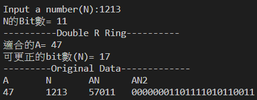
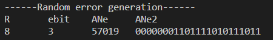
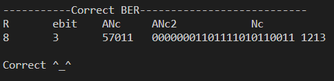
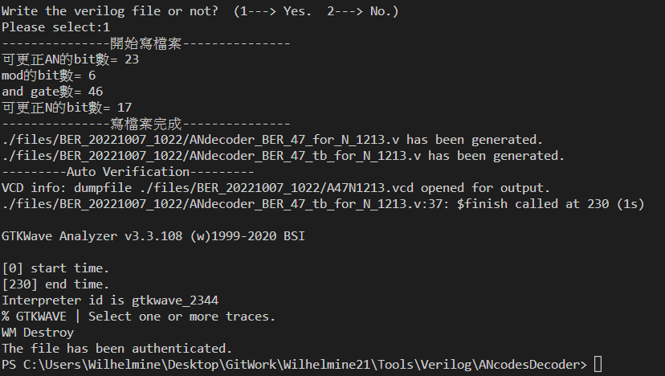
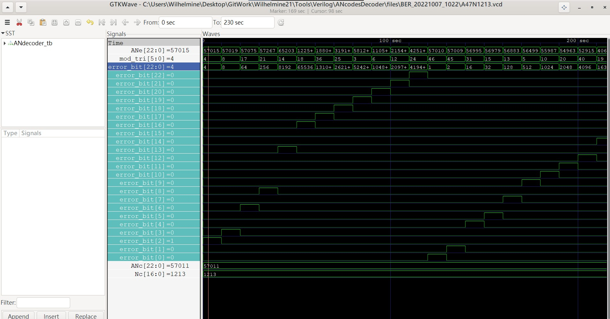

# AN codes decoder
* 4 error models - [[Know more]](https://github.com/Wilhelmine21/Wilhelmine21/blob/main/MyProject_GUI/AN%20Codes.md#4-error-model)
    1. Uni-direction / Fully asymmetric channel model (完全非對稱模型)
        * Error will only occur in uni-direction.事先知道哪一個1->0/0->1
    2. Alternative-direction / Fully asymmetric channel model 
        * 無法事先知道哪一個
        * 莫比烏斯環
    3. Bit Error Rate mode (BER)
        * 這bit從0->1 or 1->0, 但是各有機率
    4. AWE 
        * error come from add or sub.

* Versions
    * v1: 
        * input: numX, R
        * output: out
    * v2:
        * input: numX
        * output: out
    * v3:
        * input: ANe
        * output: Nc

* Terminal(V3):
    * Step1:選擇A的模式
        > -------------Find an available A-------------  
        > 雙向錯誤可用的A(8~100)=[11, 13, 19, 23, 29, 37, 47, 53, 59, 61, 67, 71, 79, 83]  
        > 可更正bit數(N)=[1, 2, 4, 6, 9, 12, 17, 20, 23, 24, 26, 28, 32, 34]  
        > 單向錯誤可用的A(7~100)=[11, 13, 19, 29, 37, 53, 59, 61, 67, 83]  
        > 可更正bit數(N)=[6, 8, 13, 23, 30, 46, 52, 54, 59, 75]    
        > 
        > -------------Find the most appropriate A-------------  
        > 雙向錯誤最合適的A=[13, 29, 61, 83]
        > 可更正bit數(N)=[2, 9, 24, 34]
        > 單向錯誤最合適的A=[13, 29, 61, 83]
        > 可更正bit數(N)=[8, 23, 54, 75]
        > 
        > mode 1 ---> Find an available A  
        > mode 2 ---> Find the most appropriate A 
        > Please select a mode:1   
    * Step2:選擇Error models
        > model 1 ---> Uni-direction Fully Asymmetric Channel model  
        > model 2 ---> Alternative-direction Fully Asymmetric Channel model  
        > model 3 ---> BER model  
        > model 4 ---> AWE model  
        > Choose model:3  
    * Step3:輸入數字並軟體驗證更正能力
        * Step3-1: 輸入數字
           
        * Step3-2: 隨機1位元錯誤植入
           
        * Step3-3: AN codes的更正方法(餘數對應錯誤位元)
           
    * Step4:生成解碼器Verilog file
        * Step4-1: 將基本更正資訊寫入          
        * Step4-2:生成檔案(包含tb)並呼叫iverilog & GTKwave進行驗證
          
* 波形圖驗證:
  
